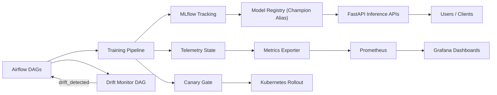

# End-to-End MLOps for Time-Series Forecasting

Production-style MLOps platform for forecasting with configurable ingestion, champion/challenger training, autonomous retraining triggers, API serving, monitoring, and canary gating.

## Public Project Link Setup
- One-link public showcase page lives at `docs/index.md` (GitHub Pages-ready).
- Publish guide: `docs/PUBLISH.md`.
- After enabling Pages, share:
  - `https://<your-username>.github.io/<your-repo>/`

## Architecture Diagram


## Production Features
- Concurrency-safe model promotion using file lock + timeout metrics.
- Run isolation with `data/runs/<run_id>/` and `models/<run_id>/` paths.
- Autonomous retraining trigger: hourly drift monitor DAG triggers retrain DAG only when drift is detected.
- Business KPI telemetry: `forecast_accuracy_percent` and `model_impact_percent` tracked per run.
- Canary deployment gate with promote/hold/rollback decisioning.
- Chaos test utility to simulate container failures and validate recovery.
- Secret-aware deployment (Docker env vars + Kubernetes Secrets + Vault External Secrets).

## Quickstart (Docker)
```bash
docker compose -f deploy/docker/docker-compose.yml up -d --build
```

- Airflow UI: `http://localhost:8080`
- MLflow UI: `http://localhost:5000`
- API: `http://localhost:8000`
- Registry inference API: `http://localhost:8001`
- Metrics exporter: `http://localhost:9100/metrics`
- Prometheus: `http://localhost:9092`
- Grafana: `http://localhost:3002`

## Airflow DAGs
- `forecasting_retrain_dag`: ingestion -> training -> drift check -> canary decision -> rollout action.
- `drift_monitor_trigger_dag`: runs hourly, computes drift, triggers `forecasting_retrain_dag` when drift detected.

## Demo
### API Example
```bash
curl -X POST http://localhost:8001/predict \
  -H "Content-Type: application/json" \
  -d '{"lag_1": 102.4, "lag_7": 98.1, "rolling_mean_7": 100.9, "day_of_week": 1, "month": 3}'
```

### Chaos Test Example
```bash
python scripts/chaos_test.py --service airflow --downtime 20
```

### Screenshots
Add screenshots in `docs/images/`:
- `airflow-home.png`
- `airflow-grid-success.png`
- `mlflow-home.png`
- `grafana-home.png`
- `metrics-endpoint.png`

## Secrets Management
### Local (Docker)
Set secrets in `.env` (not committed):
- `POSTGRES_USER`
- `POSTGRES_PASSWORD`
- `POSTGRES_DB`
- `DATABASE_URL`
- `SLACK_WEBHOOK_URL`

### Kubernetes (Basic)
```bash
kubectl apply -f k8s/secret.example.yaml
kubectl apply -f k8s/deployment.yaml
kubectl apply -f k8s/service.yaml
kubectl apply -f k8s/ingress-canary.yaml
kubectl apply -f k8s/hpa.yaml
```

### Kubernetes + Vault (Production)
This repo includes templates for External Secrets integration:
- `k8s/clustersecretstore.vault.example.yaml`
- `k8s/externalsecret.forecasting.example.yaml`

Apply flow:
```bash
# 1) Install external-secrets operator in cluster (one-time)
# 2) Configure Vault role + policy for key path forecasting/prod
kubectl apply -f k8s/clustersecretstore.vault.example.yaml
kubectl apply -f k8s/externalsecret.forecasting.example.yaml
kubectl apply -f k8s/deployment.yaml
kubectl apply -f k8s/service.yaml
kubectl apply -f k8s/ingress-canary.yaml
kubectl apply -f k8s/hpa.yaml
```

`ExternalSecret` syncs Vault values into Kubernetes Secret `forecasting-secrets`, and deployment consumes:
- `DATABASE_URL`
- `SLACK_WEBHOOK_URL`
